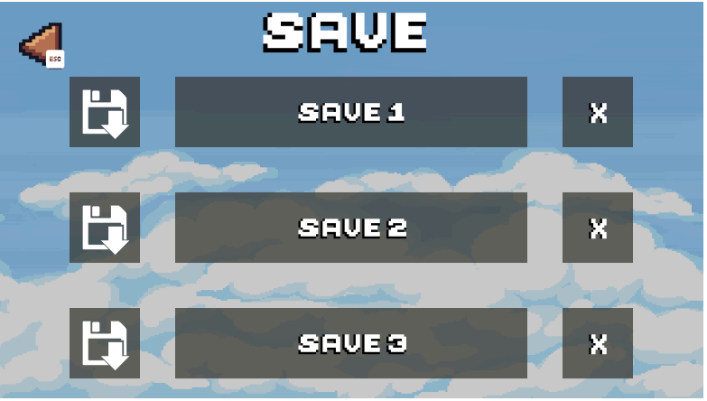
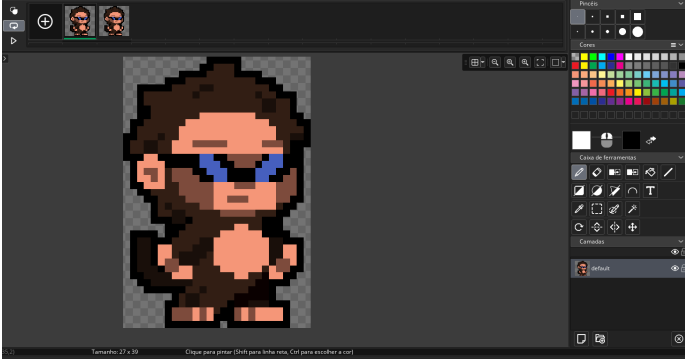
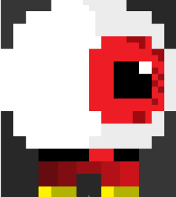

# Relatório PAP 2024

## Curso Profissional Técnico de Gestão de Equipamentos Informáticos

**Prova de Aptidão Profissional**  
**Projeto:** Jogo 2D no Game Maker  

**Fig. 1 – Capa do Jogo**

**Nome do aluno:** João Murta  
**Nº:** 7  
**Ano:** 12º  
**Turma:** P  

**Professor Orientador:** Nelson Filipe Lourenço Vieira  
**Diretor de Curso:** Nelson Filipe Lourenço Vieira  

---

## Agrupamento de Escolas Poeta António Aleixo

---

## Índice

- [Resumo](#resumo)
- [Introdução](#introdução)
- [Agradecimentos](#agradecimentos)
- [Desenvolvimento](#desenvolvimento)
  - Pesquisa sobre o projeto
  - Pontos importantes implementados no jogo
  - Sprites personalizados
  - Programação importante do projeto
- [Resolução de Problemas](#resolução-de-problemas)
- [Conclusão](#conclusão)
- [Melhorias Futuras](#melhorias-futuras)
- [Considerações Finais](#considerações-finais)
- [Mais Fotografias](#mais-fotografias)
- [Netgrafia](#netgrafia)

---

## Resumo

O presente trabalho de Prova de Aptidão Profissional (PAP) teve como objetivo desenvolver um jogo 2D utilizando a plataforma **Game Maker**. Este projeto surgiu do meu interesse por jogos e do desejo de aplicar os conhecimentos adquiridos no Curso Técnico de Gestão de Equipamentos Informáticos.

Ao longo do desenvolvimento, foram abordados vários aspetos essenciais para a criação de um jogo, desde o design e a programação até à implementação de funcionalidades interativas.

O processo incluiu a criação de personagens, cenários, mecânicas de jogo e um sistema robusto de **save/load**. Enfrentei diversos desafios técnicos que foram superados através de pesquisa e testes rigorosos.

O resultado final é um jogo 2D funcional que reflete as habilidades adquiridas ao longo do curso, destacando a importância da pesquisa contínua e da resolução de problemas no desenvolvimento de software.

---

## Introdução

Este trabalho de Prova de Aptidão Profissional (PAP) tem como foco o desenvolvimento de um jogo 2D utilizando a plataforma **Game Maker**.

A escolha deste tema foi impulsionada pelo meu gosto por jogos e pela vontade de aplicar os conhecimentos de programação adquiridos ao longo do curso.

Os jogos são uma forma de entretenimento amplamente difundida, podendo também ser ferramentas educativas. Contudo, a sua criação envolve desafios como planeamento, design, programação e testes.

Este projeto tem como objetivo criar um jogo envolvente e tecnicamente sólido, explorando as funcionalidades do Game Maker e analisando os resultados obtidos em termos de jogabilidade, desempenho e experiência do utilizador.

---

## Agradecimentos

Gostaria de expressar a minha profunda gratidão aos meus colegas e a todos os que me acompanharam durante o estágio.

O apoio, as ideias, o feedback construtivo e o incentivo constante foram fundamentais para o sucesso deste projeto.

---

## Desenvolvimento

### Pesquisa sobre o projeto

Este projeto envolveu uma extensa pesquisa sobre os fundamentos do desenvolvimento de jogos 2D e as funcionalidades específicas do **Game Maker**.

Inicialmente, não possuía conhecimentos da linguagem utilizada, mas através de tutoriais, documentação oficial e exemplos práticos, consegui adquirir as competências necessárias.

O projeto incluiu a implementação de mecânicas variadas, inimigos com comportamentos distintos e obstáculos que aumentam a complexidade dos níveis.

---

### Pontos importantes implementados no jogo

Principais funcionalidades:

- **Sistema de Save e Load**  
  Salvamento e carregamento automático do progresso do jogador.
  
  *Fig. 2 – Sistema de save*

- **Liberdade de escolha de controlo**  
  Suporte para comandos Xbox, PS4 e genéricos.

- **Controles Intuitivos**  
  Jogabilidade fluida e fácil de usar.

- **Design de Níveis**  
  Níveis com dificuldade progressiva.

- **Elementos Gráficos**  
  Sprites personalizados e animações.

- **Áudio e Efeitos Sonoros**  
  Música de fundo e efeitos imersivos.

---

### Como foram feitos os sprites personalizados

Os sprites foram inteiramente criados por mim, com inspirações retiradas da internet.

Cada movimento foi desenhado manualmente, passando por um processo de tentativa e erro. O feedback de colegas foi essencial para melhorar os resultados.
- 

*Fig. 3 – Sprite do player*
- 

*Fig. 4 – Sprite inimigo*
- 

- *Fig. 5 – Sprite player alternativo*
---

### Programação importante do projeto

#### Aceitação de dispositivos externos

Foi criado um objeto específico responsável por gerir os comandos externos.

- *Fig. 6 – Objeto do jogo*
- *Fig. 7 – Código de verificação do comando*
- *Fig. 8 – Função de deteção do comando*

Características:
- Objeto persistente
- Verificação contínua no evento `Step`
- Deadzone configurada para analógicos
- Atualização dinâmica dos ícones conforme o comando ligado

---

### Sistema de Save

#### Tipos de ficheiros salvos

- **Settings:** configurações do jogo
- **Level:** progresso do jogador

#### Save/Load automático das settings

- Funções específicas para salvar e carregar
- Criação automática do ficheiro
- Salvamento imediato após alterações

- *Fig. 9 – Scripts de save/load*

#### Save manual

- Suporte para múltiplos slots
- Ativado pelo jogador

- *Fig. 10 – Save manual*
- *Fig. 11 – Menu de save*

#### Save automático dos níveis

- Salvamento automático ao completar níveis
- Carregamento automático no início do jogo

- *Fig. 12 – Save automático do level*
- *Fig. 13 – Load automático do level*

---

### Player

#### Lógica inicial

Criação de um objeto base `obj_entidade`, pai de jogadores e inimigos.

- *Fig. 14 – Objeto entidade*
- *Fig. 15 – Explicação do objeto entidade*

Implementação de hitbox dividida em quatro partes:

- *Fig. 16 – BBox*
- *Fig. 17 – Código da BBox*

---

#### Lógica do player

O player utiliza uma **state machine**, dividindo o comportamento em estados.

- *Fig. 18 – Objeto player*
- *Fig. 19 – Create do player*
- *Fig. 20 – State machine*

---

### Inimigos

Os inimigos utilizam a mesma lógica de state machine e herdam o sistema de colisões.

- *Fig. 21 – Create obj_pai_inimigos*
- *Fig. 22 – Objeto pirata*
- *Fig. 23 – Create do pirata*
- *Fig. 24 – Step do pirata*

Estados implementados:
- Free
- Dano
- Chase
- Ataque

- *Fig. 25 – Free*
- *Fig. 26 – Dano*
- *Fig. 27 – Chase*
- *Fig. 28 – Ataque*
- *Fig. 29 – Hitbox*

---

## Resolução de Problemas

Durante o desenvolvimento, enfrentei vários problemas técnicos que foram resolvidos através de pesquisa, testes e persistência.

Este processo foi essencial para garantir a estabilidade e funcionamento correto do jogo.

---

## Conclusão

O desenvolvimento deste jogo 2D proporcionou uma experiência prática e enriquecedora em programação, design e gestão de projetos.

O projeto final demonstra as competências adquiridas e a capacidade de resolver problemas técnicos de forma eficaz.

---

## Melhorias Futuras

- Melhorar gráficos e animações
- Adicionar novos níveis e personagens
- Otimizar performance
- Incorporar feedback dos jogadores
- Lançamento mobile
- Sistema de estrelas por nível
- Sistema de recompensas
- Sons e músicas originais

---

## Considerações Finais

Este projeto representou uma evolução significativa das minhas competências técnicas e pessoais, servindo como base sólida para futuros projetos na área de desenvolvimento de jogos.

---

## Mais Fotografias

- *Fig. 30 – Seleção de níveis*
- *Fig. 31 – Configurações do jogo*

---

## Netgrafia

### Canais YouTube
- https://www.youtube.com/@gui_oficial/videos
- https://www.youtube.com/c/PontoeV%C3%ADrgulaOficial/videos
- https://www.youtube.com/@noneclass/videos
- https://www.youtube.com/@Tari1/videos
- https://www.youtube.com/@BadGameDev/videos
- https://www.youtube.com/@GEMAPLYS/videos
- https://www.youtube.com/@livesdogemaplys/videos
- https://www.youtube.com/@GameMakerEngine/videos
- https://www.youtube.com/@ShaunJS/videos

### Sites
- Sons: https://freesound.org/
- Música:  
  - https://www.youtube.com/watch?v=TUxT9FP8PkQ  
  - https://www.youtube.com/watch?v=EOI42tiHOXQ
- Manual GameMaker: https://manual.gamemaker.io/
