# PAP Report 2024

## Professional Course – Computer Equipment Management Technician

**Professional Aptitude Test**  
**Project:** 2D Game in Game Maker  

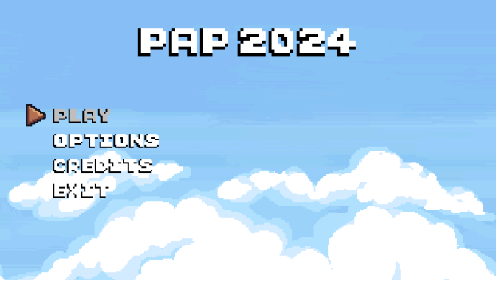

**Fig. 1 – Game Cover**

---

## Index

- [Abstract](#abstract)
- [Introduction](#introduction)
- [Development](#development)
  - Project Research
  - Important Points Implemented in the Game
  - Custom Sprites
  - Important Project Programming
- [Problem Solving](#problem-solving)
- [Conclusion](#conclusion)
- [Future Improvements](#future-improvements)
- [Final Considerations](#final-considerations)
- [More Pictures](#more-pictures)
- [Webgraphy](#webgraphy)

---

## Abstract

This Professional Aptitude Test (PAP) project aimed to develop a 2D game using the **Game Maker** platform. This project arose from my interest in games and my desire to apply the knowledge acquired during the Computer Equipment Management Technician course.

Throughout the development, several essential aspects of game creation were addressed, from design and programming to the implementation of interactive features.

The process included the creation of characters, scenarios, game mechanics, and a robust **save/load** system. I faced several technical challenges that were overcome through research and rigorous testing.

The final result is a functional 2D game that reflects the skills acquired throughout the course, highlighting the importance of continuous research and problem-solving in software development.

---

## Introduction

This Professional Aptitude Test (PAP) focuses on the development of a 2D game using the **Game Maker** platform.

The choice of this theme was driven by my passion for games and my desire to apply the programming knowledge acquired during the course.

Games are a widely spread form of entertainment and can also serve as educational tools. However, their creation involves challenges such as planning, design, programming, and testing.

This project aims to create an engaging and technically solid game, exploring Game Maker’s features and analyzing the results in terms of gameplay, performance, and user experience.

---

## Development

### Project Research

This project involved extensive research on the fundamentals of 2D game development and the specific features of **Game Maker**.

Initially, I had no knowledge of the programming language used, but through tutorials, official documentation, and practical examples, I was able to acquire the necessary skills.

The project included the implementation of various mechanics, enemies with distinct behaviors, and obstacles that increase the complexity of the levels.

---

### Important Points Implemented in the Game

Main features:

- **Save and Load System**  
  Automatic saving and loading of the player’s progress.  

  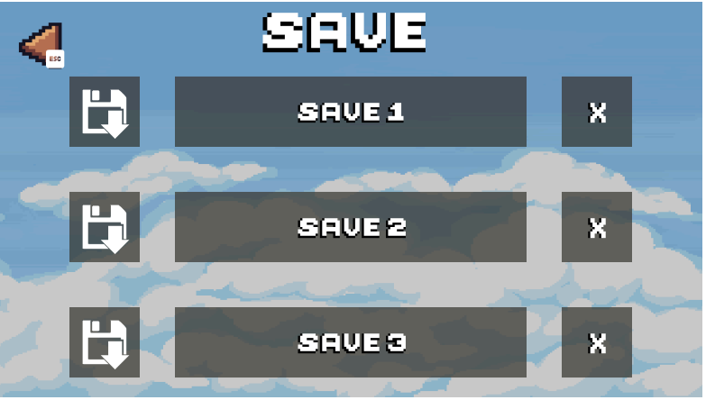
  
  *Fig. 2 – Save system*

- **Control Freedom**  
  Support for Xbox, PS4, and generic controllers.

- **Intuitive Controls**  
  Smooth and easy-to-use gameplay.

- **Level Design**  
  Levels with progressive difficulty.

- **Graphic Elements**  
  Custom sprites and animations.

- **Audio and Sound Effects**  
  Background music and immersive sound effects.

---

### How the Custom Sprites Were Made

The sprites were entirely created by me, with inspiration taken from the internet.

Each movement was manually drawn, going through a trial-and-error process. Feedback from classmates was essential to improve the results.

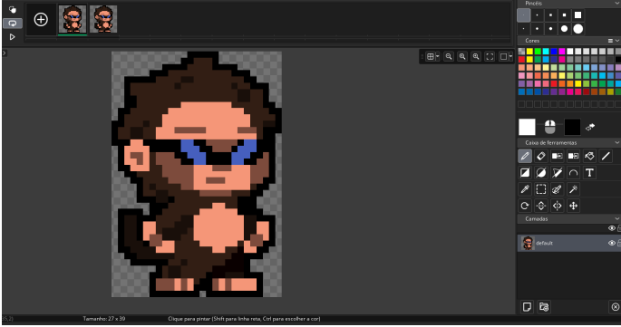

*Fig. 3 – Player sprite*

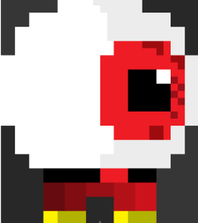

*Fig. 4 – Enemy sprite*

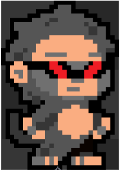

*Fig. 5 – Alternative player sprite*

---

### Important Project Programming

#### External Device Support

A specific object was created to manage external controllers.

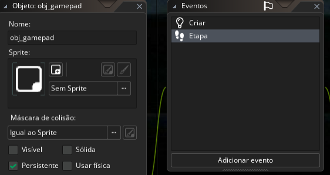

*Fig. 6 – Game object*

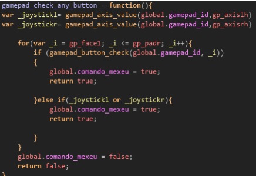

*Fig. 7 – Command verification code*

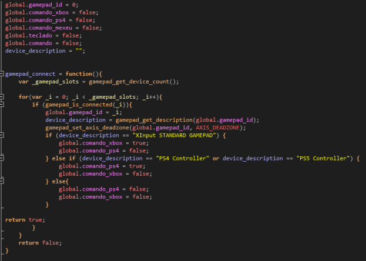

*Fig. 8 – Command detection function*

Features:
- Persistent object  
- Continuous verification in the `Step` event  
- Configurable deadzone for analog sticks  
- Dynamic icon updates according to the connected controller  

---

### Save System

#### Types of Saved Files

- **Settings:** game configurations  
- **Level:** player progress  

#### Automatic Save/Load of Settings

- Specific functions to save and load  
- Automatic file creation  
- Immediate saving after changes  

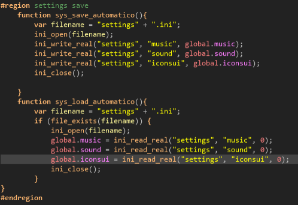

*Fig. 9 – Save/Load scripts*

#### Manual Save

- Support for multiple slots  
- Activated by the player  

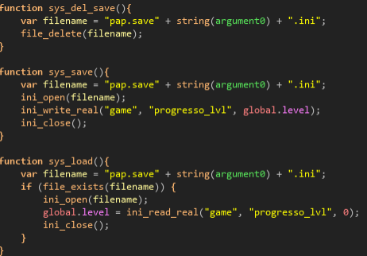

*Fig. 10 – Manual save*

*Fig. 11 – Save menu*

#### Automatic Level Save

- Automatic saving upon level completion  
- Automatic loading at the start of the game  

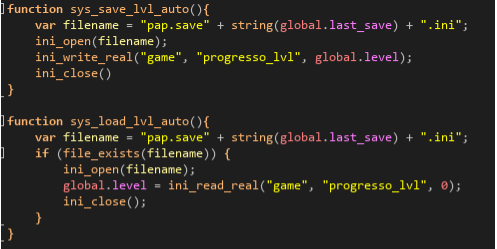

*Fig. 12 – Automatic level save*

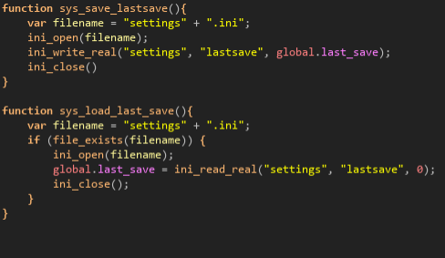

*Fig. 13 – Automatic level load*

---

### Player

#### Initial Logic

Creation of a base object `obj_entidade`, parent of players and enemies.

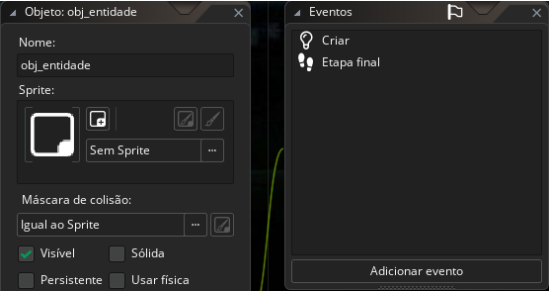

*Fig. 14 – Entity object*

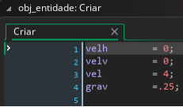

*Fig. 15 – Explanation of the entity object*

Implementation of a hitbox divided into four parts:

*Fig. 16 – BBox*

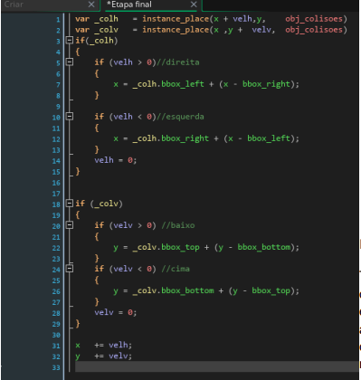

*Fig. 17 – BBox code*

---

#### Player Logic

The player uses a **state machine**, dividing behavior into different states.

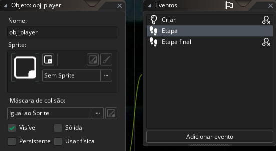

*Fig. 18 – Player object*

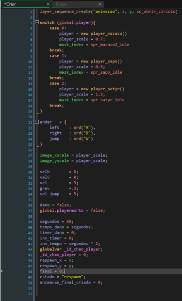

*Fig. 19 – Player Create event*

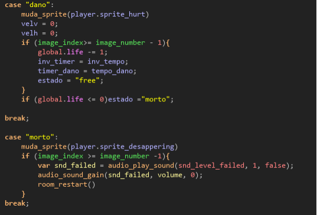

*Fig. 20 – State machine*

---

### Enemies

Enemies use the same state machine logic and inherit the collision system.

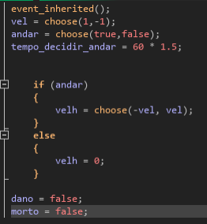

*Fig. 21 – Create obj_parent_enemies*

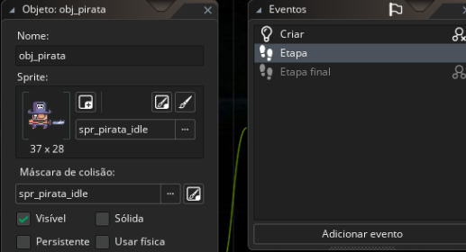

*Fig. 22 – Pirate object*

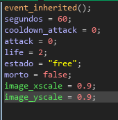

*Fig. 23 – Pirate Create event*

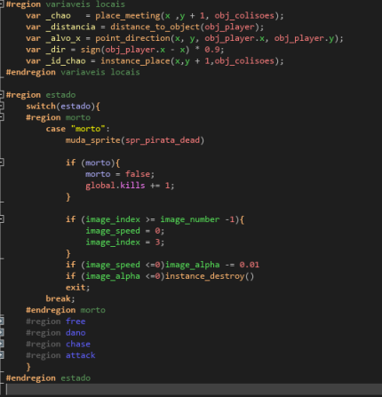

*Fig. 24 – Pirate Step event*

Implemented states:
- Free  
- Damage  
- Chase  
- Attack  

*Fig. 25 – Free*

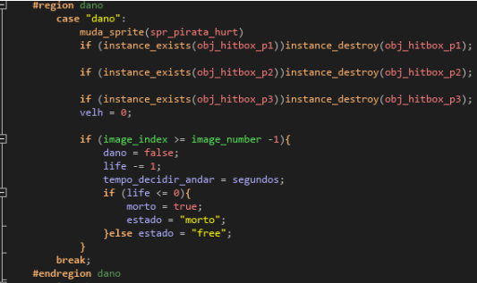

*Fig. 26 – Damage*

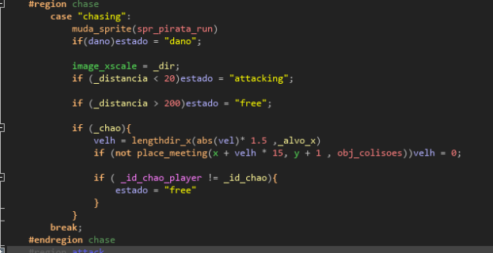

*Fig. 27 – Chase*

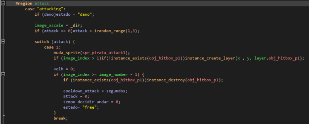

*Fig. 28 – Attack*

- *Fig. 29 – Hitbox*

---

## Problem Solving

During development, I faced several technical problems that were solved through research, testing, and persistence.

This process was essential to ensure the stability and proper functioning of the game.

---

## Conclusion

The development of this 2D game provided a practical and enriching experience in programming, design, and project management.

The final project demonstrates the skills acquired and the ability to effectively solve technical problems.

---

## Future Improvements

- Improve graphics and animations  
- Add new levels and characters  
- Optimize performance  
- Incorporate player feedback  
- Mobile release  
- Star rating system per level  
- Reward system  
- Original sounds and music  

---

## Final Considerations

This project represented a significant evolution of my technical and personal skills, serving as a solid foundation for future projects in the field of game development.

---

## More Pictures

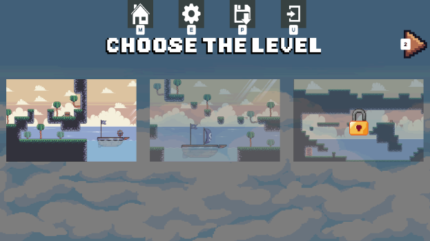

*Fig. 30 – Level selection*

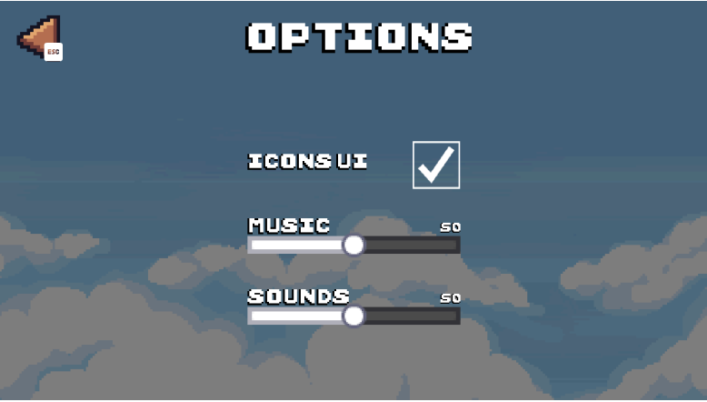

*Fig. 31 – Game settings*

---

## Webgraphy

### YouTube Channels
- https://www.youtube.com/@gui_oficial/videos
- https://www.youtube.com/c/PontoeV%C3%ADrgulaOficial/videos
- https://www.youtube.com/@noneclass/videos
- https://www.youtube.com/@Tari1/videos
- https://www.youtube.com/@BadGameDev/videos
- https://www.youtube.com/@GEMAPLYS/videos
- https://www.youtube.com/@livesdogemaplys/videos
- https://www.youtube.com/@GameMakerEngine/videos
- https://www.youtube.com/@ShaunJS/videos

### Websites
- Sounds: https://freesound.org/
- Music:  
  - https://www.youtube.com/watch?v=TUxT9FP8PkQ  
  - https://www.youtube.com/watch?v=EOI42tiHOXQ  
- GameMaker Manual: https://manual.gamemaker.io/
